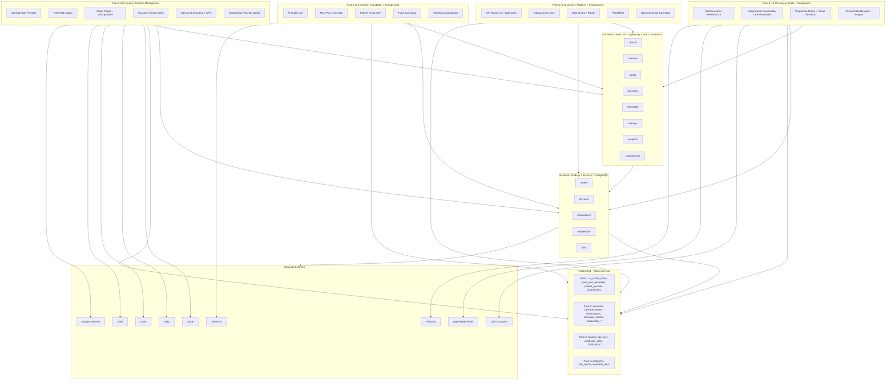

# Arquitectura por Fases — Veridia HealthTech

> Stack base confirmado para largo plazo, con evolución progresiva por fase.

---

## 1. Stack actual y evaluación a largo plazo

| Capa | Tecnología actual | Evaluación 2026 | Proyección 5-10 años |
|------|-------------------|-----------------|----------------------|
| **Frontend** | React 18 + TypeScript + Vite + Tailwind v4 + shadcn/ui | ✅ Excelente | ✅ Seguro. React 19 Server Components; migración natural a Next.js si se necesita SSR/SSG |
| **Estado** | Zustand | ✅ Bueno | ✅ Ligero, mantenido, sin dependencias pesadas |
| **Backend** | Node.js + Express | ⚠️ Suficiente hoy | ⚠️ Express es minimalista; NestJS si crece a microservicios o necesita DI/testing estructurado |
| **API** | REST + Axios + JWT + refresh | ✅ Funcional | ✅ JWT sigue siendo estándar; considerar GraphQL si frontend necesita queries complejas |
| **Base de datos** | PostgreSQL | ✅ Excelente | ✅ Estándar industrial, maduro, amplio soporte |
| **IA** | Gemini AI proxy | ✅ Bueno | ✅ Modelos evolucionan; capa de abstracción permite swap |
| **Hosting** | Docker + VPS | ✅ Suficiente | ✅ Docker es estándar; cloud-native si escala |

### Recomendación de stack a largo plazo

```
LARGO PLAZO (3-5 años) - Escenario probable:

Frontend:
- React 18/19 + TypeScript (mantener)
- Posible migración a Next.js para:
  - Server Components (mejor performance)
  - SSR/SSG para SEO (si hay páginas públicas)
  - API Routes (unificar backend/frontend)
  - Pero NO es obligatorio; Vite + React Router sigue siendo válido

Backend:
- Mantener Node.js
- Si el equipo crece o necesita estructura más rígida:
  - Migrar Express → NestJS (DI, módulos, testing integrado)
  - O mantener Express + agregar capas de servicio como está planeado
- Para microservicios (fase 4+):
  - Considerar message queue (RabbitMQ/BullMQ)
  - API Gateway ( Kong / Express Gateway )

Base de datos:
- PostgreSQL (mantener)
- Agregar: Redis para cache/sesiones (Fase 2)
- Agregar: Elasticsearch si necesita búsqueda full-text avanzada (Fase 3)

IA:
- Capa de abstracción en backend/src/integrations/openai.js
- Permite swap entre Gemini, OpenAI, Anthropic sin tocar lógica de negocio
- Futuro: modelos locales (Llama 3, Mistral) para reducir costo

Infraestructura:
- Docker Compose (dev) → Kubernetes (production, si escala)
- CI/CD: GitHub Actions (ya implícito)
- Monitoring: Prometheus + Grafana (agregar en Fase 3)
```

---

## 2. Diagrama de arquitectura por fases



---

## 3. Flujo de datos por capa

```
┌─────────────┐     HTTPS/JSON      ┌─────────────┐     SQL       ┌───────────┐
│   Browser   │ ◄─────────────────► │   Express   │ ◄─────────► │PostgreSQL │
│ React 18    │                     │   Routes    │             │  + RLS    │
│ + Vite      │                     │ + Services  │             │           │
└─────────────┘                     └──────┬──────┘             └───────────┘
                                            │
                          ┌─────────────────┼─────────────────┐
                          │                 │                 │
                          ▼                 ▼                 ▼
                    ┌──────────┐     ┌──────────┐     ┌──────────┐
                    │ Stripe   │     │ Twilio   │     │  Zoom    │
                    │ (pagos)  │     │ (SMS)    │     │(video)   │
                    └──────────┘     └──────────┘     └──────────┘
```

---

## 4. Patrones de diseño por dominio

### AI Scribe
```
Audio → Frontend (MediaRecorder) → Base64 → POST /api/ai-scribe/transcribe
→ Backend (ai-scribe.service.js) → Gemini/Whisper → SOAP JSON → DB
→ Frontend: editor + guardar en historia clínica
```

### Meal Plan Generator
```
Objetivos (calorías, macros, alergenos) → POST /api/meal-plans/generate
→ Backend (meal-generator.service.js) → algoritmo → plan semanal JSON → DB
→ Frontend: preview + edición manual
```

### Patient Portal
```
Paciente → /portal/login → JWT paciente → /portal/plans, /portal/journal
→ Backend (patient-portal.routes.js) → RLS por patient_id → DB
→ Frontend: React Router + ProtectedRoute paciente
```

### Agenda Multi-Provider
```
Profesional → /appointments → CalendarView (FullCalendar o custom)
→ Backend (calendar.service.js) → Google Calendar API sync → DB
→ Recordatorios → Twilio SMS/email
```

### Stripe Pagos
```
Frontend → Stripe Checkout → Webhook → Backend (stripe.service.js)
→ Actualiza subscriptions, payments en DB → Notifica paciente
```

### Insurance Claims
```
Frontend → eligibility check → POST /api/insurance/verify
→ Backend (insurance.service.js) → Stedi API (270/271) → DB
→ Submit claim → Stedi (837P) → tracking → UI
```

---

## 5. Evolución del stack a largo plazo

### Escenario A: Crecimiento estándar (1-10 profesionales)
```
Mantener stack actual + Fases 1-2
- Express suficiente
- Vite suficiente
- PostgreSQL suficiente
- Agregar Redis para cache (sesiones, refresh tokens)
```

### Escenario B: Crecimiento medio (10-50 profesionales, multi-tenant)
```
Fase 3 completa
- Mantener Express o migrar a NestJS si el equipo crece
- Agregar message queue (BullMQ + Redis) para:
  - Procesamiento de audio AI Scribe (background job)
  - Envío de emails/SMS masivos
  - Sincronización de calendarios
- Agregar Elasticsearch si necesita búsqueda full-text en historias clínicas
```

### Escenario C: Enterprise / Escala (50+ profesionales, multi-región)
```
Fase 4 completa
- Considerar microservicios si hay bottlenecks:
  - Servicio de IA (Python/FastAPI) → mejor para ML models
  - Servicio de Payments → aislamiento PCI
  - Servicio de Reporting → queries pesadas
- API Gateway (Kong / Express Gateway)
- Kubernetes para orquestación
- Monitoring: Prometheus + Grafana + Sentry
- Data warehouse (ClickHouse) para analytics masivos
```

### Cuándo migrar Express → NestJS
```
Señales:
- Equipo > 3-4 devs backend
- Necesidad de testing estructurado (Jest + Supertest)
- Necesidad de módulos bien definidos (Auth, Patients, Billing)
- Necesidad de WebSockets (notificaciones real-time)
- Necesidad de microservicios

Ventajas NestJS:
- DI container
- Módulos nativos
- Guards, interceptors, pipes
- Documentación Swagger automática
- TypeScript first-class

Desventajas:
- Overhead inicial
- Curva de aprendizaje
- Más boilerplate
```

---

## 6. Resumen de recomendación

**Respuesta directa:**
- El stack actual (React + TS + Node/Express + PostgreSQL) es **correcto y funcional a largo plazo**.
- No requiere reescritura.
- La evolución natural es: Express → NestJS (si crece) y posiblemente Vite → Next.js (si necesita SSR/SSG).
- PostgreSQL es apuesta segura para toda la vida del proyecto.
- La capa de abstracción en `integrations/` permite swap de proveedores (Gemini→OpenAI, Stripe→otro) sin refactor masivo.

**Acción inmediata:**
- Proceder con Fase 1 manteniendo el stack actual.
- Re-evaluar arquitectura al final de Fase 3 (cuando haya multi-tenant + API pública).

